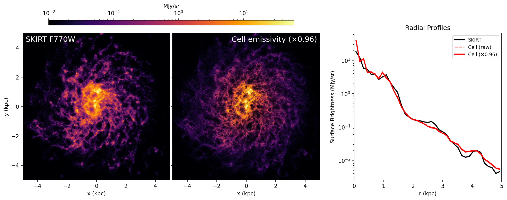

# Cell-Based 7.7 μm PAH Emissivity

Fast mock JWST MIRI F770W images from Arepo/SMUGGLE galaxy simulations — no radiative transfer required.

## Overview

This code computes a per-gas-cell 7.7 μm emissivity from an Arepo/SMUGGLE snapshot, enabling instant mock JWST MIRI F770W images from arbitrary viewing angles via 2D histogram projection. It replaces expensive SKIRT radiative transfer (~10 hr) with a ~75 second calculation.

The key physics:

```
j_7.7(i) = C_7.7 × M_dust(i) × U(i) × f_att(i)
```

where:
- **M_dust** = dust mass per cell (0.3 × Z × M_gas, matching the SKIRT configuration)
- **U** = local FUV radiation field in Mathis (1983) units, estimated geometrically from nearby young stars
- **C_7.7** = calibration constant from Draine & Li (2007), encoding PAH emission per unit dust mass
- **f_att** = Sobolev dust attenuation factor for self-shielding in dense cells

### Radiation Field Estimation

The FUV radiation field uses a three-tier hybrid approach:

1. **FFT grid far-field** (512³, 60 kpc box): CIC-deposits all young stellar FUV luminosity onto a grid and convolves with a 1/r² kernel via FFT. Captures long-range contributions.
2. **KDTree near-field** (K=32 nearest young stars): Preserves sub-grid detail near star clusters.
3. **Adaptive softening**: Per-star Plummer softening (h = 0.5 × d_8nn) reduces point-source artifacts.

Combined as U = max(U_grid, U_near). Stellar FUV luminosities come from BPASS v2 binary population spectra (Chabrier IMF), integrated over 912–3000 Å.

## Installation

```bash
pip install -r requirements.txt
```

The validation scripts (`validate.py`, `validate_all.py`) also require [PTS](https://github.com/SKIRT/PTS9) for F770W filter convolution. Set the `PTS_PATH` environment variable to your PTS installation:

```bash
export PTS_PATH=/path/to/PTS
```

## Quick Start

```bash
# 1. Compute per-cell emissivity (~75 s)
python3 compute_emissivity.py --snap /path/to/snapshot.hdf5 --bpass /path/to/bpass-spectra.hdf5

# 2. Project to a 2D image at any viewing angle
python3 project.py --inc 0 --az 0          # face-on
python3 project.py --inc 90 --az 0         # edge-on

# 3. Validate against SKIRT (optional, requires PTS)
python3 validate.py --skirt /path/to/skirt_output_total.fits
python3 validate_all.py --skirt-dir /path/to/skirt_output/
python3 compare_rf.py --skirt-rf /path/to/skirt_output_rf_J_xy.fits
```

All scripts accept `--help` for full argument documentation.

## Scripts

| Script | Purpose |
|--------|---------|
| `compute_emissivity.py` | Reads Arepo snapshot, computes FUV radiation field and per-cell 7.7 μm emissivity, saves to HDF5 |
| `project.py` | Projects emissivities onto 2D images at arbitrary (inclination, azimuth), outputs MJy/sr surface brightness |
| `validate.py` | Compares face-on projection against SKIRT F770W output with radial profiles |
| `validate_all.py` | Multi-angle validation against 5 SKIRT instruments (face-on, zoom, IC 5332, inc=60°, edge-on) |
| `compare_rf.py` | Compares geometric U-field against SKIRT `RadiationFieldProbe` output |

## SKIRT Calibration

The `SKIRT_calibration/` directory contains example files for running the SKIRT radiative transfer simulation that the cell-based method is calibrated against:

- **`prep_snap.py`** — Extracts dust (gas cells), old stars (age > 10 Myr), and HII regions (age < 10 Myr) from an Arepo snapshot into SKIRT-compatible text files (`dust_data.txt`, `star_data.txt`, `HII_data.txt`)
- **`skirt.ski`** — SKIRT 9 configuration with DustEmission mode, stochastic heating, Draine & Li dust mix, Voronoi mesh, MAPPINGS SEDs for HII regions, and Bruzual-Charlot SEDs for old stars

### Running SKIRT

```bash
cd SKIRT_calibration/

# 1. Place your Arepo snapshot as snapshot.hdf5 (or edit SNAP_PATH in prep_snap.py)
# 2. Extract SKIRT input files
python3 prep_snap.py

# 3. Run SKIRT (adjust resources for your system)
skirt skirt.ski            # serial
mpirun -np 4 skirt skirt.ski   # parallel
```

### Key SKIRT Configuration

The `.ski` file defines 5 instruments at different viewing angles, used by `validate_all.py`:

| Instrument | FOV | Pixels | Distance | Inclination |
|-----------|-----|--------|----------|-------------|
| `fo` | 40 kpc | 512² | 1 Mpc | 0° (face-on) |
| `zoom` | 10 kpc | 1024² | 1 Mpc | 0° (face-on) |
| `ic5332` | 10 kpc | 1024² | 8.84 Mpc | 27° |
| `inc60` | 40 kpc | 512² | 1 Mpc | 60° |
| `eo` | 40 kpc | 512² | 1 Mpc | 90° (edge-on) |

Other notable settings:
- **Dust**: `DraineLiDustMix` with `massFraction=0.3`, `maxTemperature=75000 K`
- **Wavelength grid**: `NestedLogWavelengthGrid` (90 base + 100 sub-grid in 5.5–14 μm) to properly sample the 7.7 μm PAH feature
- **Heating**: Stochastic (full SED calculation per cell, not equilibrium)
- **Probes**: `RadiationFieldProbe` for comparison with geometric U-field estimate

## Output Format

`emissivity_snap190.h5` contains:

| Dataset | Shape | Description |
|---------|-------|-------------|
| `/gas/pos` | (N, 3) | Cell positions in kpc (centered on stellar COM) |
| `/gas/j_77` | (N,) | 7.7 μm emissivity in erg/s |
| `/gas/M_dust` | (N,) | Dust mass in M☉ |
| `/gas/U_field` | (N,) | FUV radiation field in Mathis units |
| `/gas/temperature` | (N,) | Gas temperature in K |
| `/gas/metallicity` | (N,) | Absolute metallicity |
| `/gas/f_att` | (N,) | Sobolev attenuation factor (0–1) |
| `/gas/tau_fuv` | (N,) | FUV optical depth through cell |

Metadata in `/meta/` stores all physics parameters for reproducibility.

## Validation



Validated against full SKIRT radiative transfer at multiple viewing angles:

| Instrument | FOV | Inclination | α (SKIRT/Cell) |
|-----------|-----|-------------|----------------|
| zoom | 10 kpc | 0° | 1.02 |
| ic5332 | 10 kpc | 27° | 0.95 |
| fo | 40 kpc | 0° | 2.61 |
| inc60 | 40 kpc | 60° | 2.56 |
| eo | 40 kpc | 90° | 2.43 |

Inner galaxy (r < 5 kpc) shows excellent agreement (α ≈ 1). The outer galaxy (r > 5 kpc) diverges because the cell-based method lacks inter-cell FUV extinction and scattered MIR photons.

## Dependencies

Python packages (see `requirements.txt`): numpy, scipy, h5py, matplotlib, astropy

External data/tools:
- [BPASS v2](https://bpass.auckland.ac.nz/) binary spectra table (for FUV luminosities)
- [PTS](https://github.com/SKIRT/PTS9) (validation scripts only, for F770W filter convolution; set `PTS_PATH` env var)

## Configuration

Key parameters are defined at the top of `compute_emissivity.py`:

| Parameter | Default | Description |
|-----------|---------|-------------|
| `SNAP_PATH` | `../I5_output/snap_190.hdf5` | Input Arepo snapshot |
| `BPASS_PATH` | (see source) | BPASS binary spectra HDF5 table |
| `DUST_MASS_FRACTION` | 0.3 | Dust-to-metal mass ratio |
| `AGE_CUT_MYR` | 300 | Max stellar age for FUV sources (Myr) |
| `GRID_SIZE` | 512 | FFT grid resolution per side |
| `GRID_BOX_KPC` | 60 | FFT grid box size (kpc) |
| `K_NEAR` | 32 | Nearest neighbors for near-field U |
| `KAPPA_FUV` | 1000 cm²/g | FUV dust opacity |

## References

- Draine & Li (2007) — PAH emission model and dust properties
- Mathis, Mezger & Panagia (1983) — Interstellar radiation field
- Eldridge et al. (2017) — BPASS binary population synthesis
- Draine (2003) — FUV dust opacity
